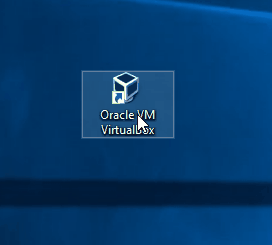

# Vbox Deploy Ansible role


This role provides the ability to authorize remote systems for passwordless
SSH authentication.

This role is helpful when you have a remote machine you want to use by
ansible and wish to use SSH key based authentication. It will handle setting
the SSH keys on the remote machine allowing you to create an ansible inventory
file with the remote machine. Then you can easily call any ansible playbook
against the remote machine.

## Role Variables

Below are the available varaibles you will need to supply to the role.

| Variable | Description | Var Type | Example |
| --- | --- | --- | --- |
| vbox_user | User used in the deploy | String | vbox_user: user | 
| vbox_dir_isos | Directory containing the isos | String | vbox_dir_isos: "/home/{{ vbox_user }}/ImagesISOs" | 
| vbox_dir_vms | Directory containing the VMs | String | vbox_dir_vms: "/home/{{ vbox_user }}/VMs" |
| vbox_images_isos | public key file (absolute path) to set into remote system | List containing dictionaries |  vbox_images_isos: List {} {}|
| vbox_custom_isos | SSH port to connect to | List containing dictionaries | vbox_custom_isos: - {name: ..., url: ..., path: ...} | 
| vbox_vms_options | SSH port to connect to | List containing dictionaries | vbox_vms_options: - {} {} | 

## Example Playbook

```yaml
---
- name: Vbox Deploy Role
  hosts: localhost

  roles:
    - role: vbox_deploy_role
      vars:
        
```

## License

GPLv3

## Author Information

Javier Sánchez Bracamonte
